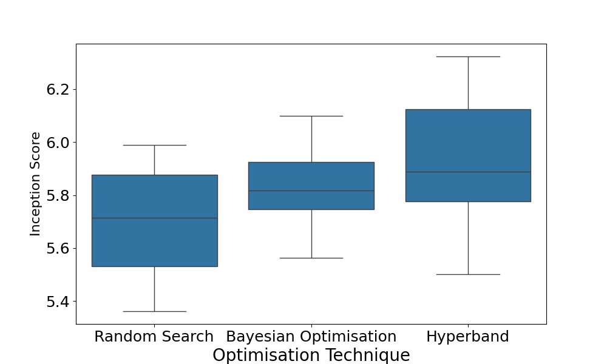
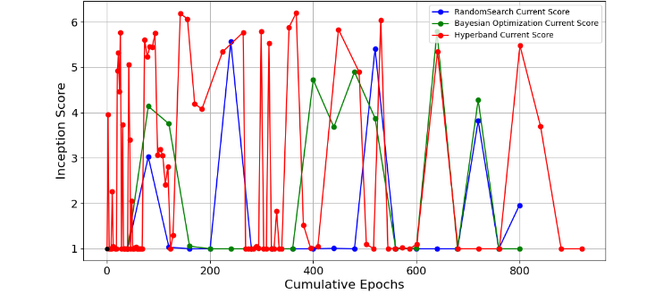

# Comparative Analysis of Hyperband, Random Search, and Bayesian Optimisation Algorithms for GAN Hyperparameter Tuning on MNIST Dataset.

This repository contains the code and resources for the research paper: **"Comparative Analysis of Hyperband, Random Search, and Bayesian Optimisation Algorithms for GAN Hyperparameter Tuning on MNIST Dataset."**

The full paper can be found here: [`paper/EE_CS.pdf`](./paper/EE_CS.pdf)

---

## Abstract

This project investigates the research question: **How do Hyperband, Random Search, and Bayesian Optimisation algorithms compare in optimizing hyperparameters for Generative Adversarial Networks (GANs) trained on the MNIST dataset?**

Generative Adversarial Networks are powerful tools for image generation, but their performance is highly dependent on hyperparameter configuration. This study implements and evaluates three key automated optimization techniques—Hyperband, Random Search, and Bayesian Optimization—to tune a GAN's dropout rate, activation function, and use of batch normalization. The analysis reveals that while **Hyperband** consistently produces higher-quality and more diverse images, its rigidity and resource intensity can be a drawback. **Bayesian Optimization** emerges as a strong alternative, offering a better balance of performance and efficiency, particularly when computational resources are limited. **Random Search**, while the least effective in image quality, provides a valuable baseline.

## Key Results

The performance of each optimization technique was evaluated using multiple metrics, including Inception Score (IS), Fréchet Inception Distance (FID), visual inspection, and discriminator accuracy.

### IS and FID Distribution (15 Epochs)

Box plots showing the distribution of scores over 10 experimental runs, highlighting Hyperband's superior median performance.

<div align="center">

| Inception Score (Higher is Better) | Fréchet Inception Distance (Lower is Better) |
| :--------------------------------: | :-----------------------------------------: |
|  |  |

</div>

### Evolution of Inception Score (40 Epochs)

These plots track the best Inception Score found over time (cumulative epochs), demonstrating the different search strategies of each algorithm.

<div align="center">

| Current IS per Epoch | Best IS Found So Far |
| :---: | :---: |
|  |  |

</div>

### Visual Inspection of Generated Images

A qualitative comparison of images generated by the best models found by each technique after 40 epochs.

<div align="center">

| Hyperband | Bayesian Optimization | Random Search |
| :---: | :---: | :---: |
|  |  |  |

</div>

### Model Losses and Discriminator Accuracy

The generator and discriminator losses show the training dynamics, while the final discriminator accuracy indicates how well each generator learned to create convincing fakes.

<div align="center">

</div>

The final discriminator accuracies were:
- **Hyperband:** 0.866
- **Bayesian Optimization:** 0.899
- **Random Search:** 0.921

A lower accuracy indicates a more effective generator, reinforcing that the Hyperband-tuned model was the most successful.

---

## How to Run the Experiment

This project was designed to be run in a **Google Colab** environment with GPU acceleration.

### 1. Setup

Clone the repository to your local machine:

```bash
git clone https://github.com/your-username/your-repository-name.git
```

### 2. Dependencies

Install the required dependencies using pip:

```bash
pip install -r requirements.txt
```

**Required packages:**
- tensorflow
- keras-tuner
- numpy
- matplotlib
- seaborn
- scikit-learn
- pandas
- scikit-image

### 3. Google Drive Configuration

The script saves all models, plots, and logs to Google Drive. Before running, you must create the following folder structure in the root of your Google Drive:

```
./MyDrive/CombinedTuner/
├── BO/
│   └── losses/
├── Hyperband/
│   └── losses/
└── RandomSearch/
    └── losses/
```

### 4. Execution

1. Upload the `notebooks/main_experiment.ipynb` file to Google Colab
2. Change the runtime type to GPU (Runtime → Change runtime type)
3. Run the cells in the notebook. The script will:
   - Mount your Google Drive (you will need to authorize this)
   - Install dependencies
   - Run the hyperparameter search for all three algorithms
   - Save all models, logs, and result plots to your Google Drive

## Project Structure

```
.
├── notebooks/
│   └── main_experiment.ipynb
├── paper/
│   └── EE_CS.pdf
├── results/
│   ├── Bayesian_Optimization_1_Epoch.png
│   ├── Bayesian_Optimization_40_Epochs.png
│   ├── Bayesian_Optimization_5_Epochs.png
│   ├── Best_Generator_and_Discriminator_Losses_Per_Epoch.png
│   ├── Best_Inception_Score_Evolution.png
│   ├── Current_Inception_Scores_Evolution.png
│   ├── FID_Distribution_15_Epochs.png
│   ├── Hyperband_1_Epoch.png
│   ├── Hyperband_40_Epochs.png
│   ├── Hyperband_5_Epochs.png
│   ├── Inception_Score_Distribution_15_Epochs.png
│   ├── Random_Search_1_Epoch.png
│   ├── Random_Search_40_Epochs.png
│   └── Random_Search_5_Epochs.png
├── README.md
└── requirements.txt
```

## Citation

If you use this work, please cite it as follows:

Beliaev, I. (2024). Comparative Analysis of Hyperband, Random Search, and Bayesian Optimisation Algorithms for GAN Hyperparameter Tuning on MNIST Dataset.
